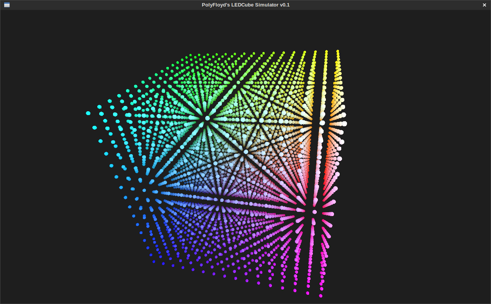

LEDCube Simulator
=================

This is a simulator I made for creating and testing programs for my LEDCube project.

## Building

Make sure you have [Go](http://golang.org/dl), GLFW3 and GLEW installed.
On Debian (and maybe Ubuntu) systems, you can install all dependencies with this command:

	sudo apt-get install git golang libgflw3-dev libglew-dev

Finally, install and build ledcubesim:

	git clone https://github.com/PolyFloyd/ledcubesim.git ledcubesim
	cd ledcubesim
	GOPATH=$PWD/gopath go get; go build

## Usage
* Moving the mouse while holding the left mousebutton will cause the view to rotate.
* Scrolling with the mouse adjust the zoom.
* Pressing R on the keyboard will reset the view to its initial condition.
* Pressing S on the keyboard will toggle the visibility of black (off) voxels.

## Command Arguments

	-cx=16: The width of the cube
	-cy=16: The length of the cube
	-cz=16: The height of the cube
	-detail=1: The level of detail
	-l=":54746": The TCP host and port for incoming connections

## Network Protocol
The network protocol consists of 3 character commands:

#### inf
Sending `inf` will cause the program to reply some technical characteristics
of the display in a binary format:

| Offset (bytes) | Data        |
| -------------- | ----------- |
| 0 - 3          | Cube Width  |
| 4 - 7          | Cube Length |
| 8 - 11         | Cube Height |
| 12 - 12        | Colormode   |
| 13 - 13        | Framerate   |

#### put
Sending `put` will prepare the program to accept one frame.
To finish, the client must send exactly one frame.
The size of a frame in bytes is determined with `width * height * length * 3`.
Color information is encoded as `RGB`.

#### swp
Sending `swp` swaps the displaybuffers.

#### ver
Sending `ver` will cause the program to reply some version and vendor information.

## Programs
Programs are included in the [programs](programs) directory.
You need Python3 to run these.
